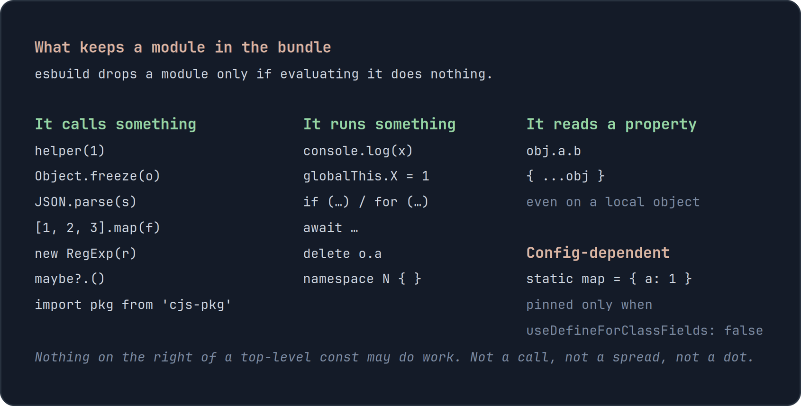

If you have worked with Nx for some time, chances are you have libraries that expose their public API through an `index.ts` file. A typical shared utility library might look like this:

```text
libs/
└── shared/
    └── utils/
        └── src/
            ├── lib/
            │   ├── date.util.ts
            │   ├── string.util.ts
            │   └── number.util.ts
            └── index.ts
```

Inside `index.ts`, you export everything consumers are allowed to use:

```ts
export * from "./lib/date.util";
export * from "./lib/string.util";
export * from "./lib/number.util";
```

Consumers can now import from a single path:

```ts
import { formatDate } from "@hs/shared/utils";
```

This is convenient. It gives the library a clear public API, hides its internal folder structure, and allows you to reorganize files without changing every consumer. There is nothing inherently wrong with this approach.

The problems start when the library grows, a subset of the exports is used by multiple applications, and those exports are loaded through different application bundles. You might inspect a production build and find code you never expected to load eagerly inside your initial bundle. Worse, you might find code in the bundle that no consumer references at all.

That can be especially surprising in a monorepo. Someone can add a utility for another application, export it from the same barrel your application already uses, and that code can start contributing bytes to your bundle without anyone touching your application.

Barrel files are often blamed for this under the broad statement that they "break tree shaking." That statement is too simplistic, but the opposite statement is also wrong. A barrel is not automatically harmless just because you only import one symbol from it.

The main reason is **side effects**. In this article, you will learn what a side effect is from a bundler's point of view, how code you never reference can still end up in your bundle, how to recognize code that esbuild cannot safely remove, and what you can do about it. In the second part, we will look at a related but different problem: code that you only import from a lazy feature ending up on the initial loading path.

> This article assumes Angular's modern `application` build system, which uses esbuild for bundling. The exact output can differ when you use the legacy webpack-based builder or a custom build setup.

## Let's start with a small example

Imagine we have a shared utility library containing two files:

```ts
// libs/shared/utils/src/lib/a.util.ts

export const a = "Hello";
```

```ts
// libs/shared/utils/src/lib/b.util.ts

export const b = "World";
```

Both utilities are exported from the library's public API:

```ts
// libs/shared/utils/src/index.ts

export * from "./lib/a.util";
export * from "./lib/b.util";
```

The library is exposed through a TypeScript path alias:

```json
{
  "compilerOptions": {
    "paths": {
      "@hs/shared/utils": ["libs/shared/utils/src/index.ts"]
    }
  }
}
```

Now imagine that eagerly loaded application code imports `a`:

```ts
import { a } from "@hs/shared/utils";
```

A lazy-loaded route imports `b`:

```ts
import { b } from "@hs/shared/utils";
```

The intuitive expectation is simple: `a` is used eagerly, so it belongs on the initial loading path, while `b` is only used by a lazy route, so it should stay lazy. That expectation is reasonable, but before we get to the lazy-loading problem, there is an even more surprising case.

What happens when nobody uses `b` at all?

If `b.util.ts` only contains a removable declaration, esbuild can drop it. Now change the file:

```ts
// b.util.ts

console.log("initializing b");

export const b = "World";
```

No consumer references `b`, but the `console.log()` is observable behavior. The module now does work when it is evaluated. Because the barrel statically re-exports from `b.util.ts`, that module is part of the module graph. If the barrel is imported by your application, esbuild cannot simply pretend that evaluating `b.util.ts` does nothing.

The `b` export may be unused, but the side effect is not. This is the first problem we need to understand.

## What is a side effect?

A side effect is code that can change something outside the value it produces, or code whose evaluation can have observable behavior. Some examples are obvious:

```ts
console.log("something");

globalThis.myValue = 42;

registerLocaleData(localeNl);

document.addEventListener("click", handler);
```

All of these do something when the module is evaluated. However, there is an important detail when we talk about bundlers: **it is not enough for you to know that an expression is harmless. The bundler must be able to prove that removing it cannot change the program.**

JavaScript makes that surprisingly difficult. Consider this:

```ts
export const labels = zones.map((zone) => zone.replace("-", " "));
```

As a developer, you might look at this and say: "That only creates an array." Esbuild sees a function call. It cannot generally prove what `.map()` or the callback will do, so it has to be conservative.

The same problem appears with code such as:

```ts
helper(1);
Object.freeze(obj);
JSON.parse(value);
new RegExp(pattern);

const value = obj.a.b;
const clone = { ...obj };
```

A property read can execute a getter. Spreading an object can read properties with getters. A function call can do anything. A constructor can do anything. Parsing can throw. Even code that looks like a simple calculation to us can contain behavior the bundler is not allowed to ignore.

That is why side-effect detection is deliberately conservative.



_The important part is not that every expression above definitely changes global state. The important part is that esbuild cannot safely prove that evaluating it does nothing._

## Esbuild does know about a few safe built-ins

There is an important exception to the conservative rule above. Esbuild contains internal knowledge about a small number of built-in JavaScript constructors and can recognize some constructor calls as removable without requiring a `/* @__PURE__ */` annotation.

For example, current esbuild versions special-case the global `Set`, `Map`, `WeakSet`, `WeakMap`, and `Date` constructors under specific conditions. This is an implementation detail rather than a general JavaScript rule, so the exact list can change between esbuild versions.

A few useful examples are:

```ts
const a = new Set();
const b = new Set([1, 2, 3]);

const c = new Map();
const d = new Map([
  ["a", 1],
  ["b", 2],
]);

const e = new Date();
const f = new Date(0);
```

If these variables are unused, esbuild knows that the constructor invocation itself can be removed. The important word here is **itself**. Marking the constructor call as removable does not automatically make its arguments removable.

Consider this:

```ts
const values = new Set([loadValue()]);
```

Esbuild recognizes the `new Set([...])` shape as safe, but `loadValue()` may still have side effects. If `values` is unused, esbuild can remove the `Set` allocation while retaining the call to `loadValue()`.

This distinction matters because "esbuild knows `new Set()` is pure" does not mean "everything inside a `new Set()` expression disappears when unused."

There are also forms that esbuild intentionally does **not** consider safe:

```ts
const values = new Set(getIterable());
```

The constructor must consume the iterable returned by `getIterable()`. Iteration can execute arbitrary JavaScript through `Symbol.iterator` and `next()`, so esbuild cannot safely assume that evaluating `new Set(getIterable())` has no observable behavior.

The same applies to `Map`:

```ts
const map = new Map(getEntries());
```

An arbitrary iterable may execute code while it is consumed. Esbuild therefore treats this differently from the more constrained form:

```ts
const map = new Map([
  ["a", 1],
  ["b", 2],
]);
```

There are a few more details worth knowing. `WeakSet` and `WeakMap` are handled more conservatively because invalid entries can throw. For example, an empty `new WeakSet([])` can be considered removable, while a non-empty array is not generally treated the same way. `new Date()` and `new Date(0)` can be removable, but `new Date(someObject)` is not automatically safe because converting the object to a primitive value can execute user code.

There is one final condition: these special cases only apply when esbuild recognizes the constructor as the global built-in. If you shadow `Set`, this is no longer the built-in that esbuild knows about:

```ts
class Set {
  constructor() {
    console.log("I definitely have a side effect");
  }
}

const values = new Set();
```

That constructor cannot be treated like the global `Set`.

So the useful mental model is not "constructors are side effects" or "`new Set()` is always pure." The better model is: **esbuild is conservative by default, with a small number of explicitly recognized safe cases. Even in those cases, side effects in the arguments are still preserved.**

## Why top-level code matters

This side-effect analysis becomes particularly important for code that runs at module evaluation time.

Consider a more realistic utility:

```ts
// libs/enclosures/utils/src/lib/zone-labels.util.ts

const ZONES = ["savanna", "aviary", "aquarium"];

export const ZONE_LABELS = ZONES.map((zone) => zone.replace("-", " "));

export function isZone(value: string) {
  return ZONES.includes(value);
}
```

And the barrel:

```ts
// libs/enclosures/utils/src/index.ts

export * from "./lib/enclosure-size.util";
export * from "./lib/capacity.util";
export * from "./lib/zone-labels.util";
export * from "./lib/feeding-window.util";
export * from "./lib/temperature.util";
```

Your application may import `enclosureSize()` and never reference `ZONE_LABELS`. Still, `ZONE_LABELS` is initialized at module evaluation time, and that initialization contains calls. Esbuild cannot assume those calls are harmless, so code that nobody in your application asked for can still contribute bytes to your bundle.

In a small application that might be a few bytes. In a monorepo it can be locale registration, polyfills, global listeners, custom-element registration, analytics setup, feature flags, lookup tables created through function calls, or third-party initialization added by another team. That is where this becomes more than an academic tree-shaking discussion.

## A barrel re-export is still a dependency

The following line looks innocent:

```ts
export * from "./lib/zone-labels.util";
```

But it is still a module dependency. If your application imports the barrel:

```ts
import { enclosureSize } from "@zoo/enclosures/utils";
```

the bundler has to analyze the modules the barrel re-exports from. If one of those modules contains top-level behavior that must be preserved, that behavior can be pulled into the bundle even though your consumer never references an export from that file.

Strictly speaking, saying "I never import `zone-labels.util.ts`" is not completely accurate. Your application does not reference anything from that file directly, but the barrel imports or re-exports it on your behalf. That distinction matters.

A useful way to think about broad barrels is this:

> When you import a barrel, you inherit the assumptions of everything behind that barrel.

If all those files are inert declarations, that can be perfectly fine. If some of them perform work during module evaluation, the barrel becomes a bridge to that work.

## How do you recognize side effects?

The easiest place to start is top-level code. When reviewing a shared library, look for code that runs while the module is being evaluated instead of when a consumer explicitly calls something.

Common examples are top-level function calls such as `registerSomething()`, `.map()`, `Object.freeze()`, `JSON.parse()`, or constructors; writes to globals, browser APIs, storage, or shared objects; event-listener registration; bare imports such as `import './register-elements';`; top-level `await`; module-level loops or conditionals that perform work; CommonJS packages whose module evaluation you do not control; and TypeScript constructs that emit runtime initialization code.

Property access also deserves attention. Something as simple as this is not always guaranteed to be inert:

```ts
const value = obj.settings.theme;
```

A property access may invoke a getter. The same is true for object spread:

```ts
const copy = { ...obj };
```

This does not mean you should stop using property access, `.map()`, or constructors. It means you should be aware of the difference between **code that looks pure to a developer** and **code a bundler can prove is removable**.

This distinction is especially important for top-level constants in utility libraries. Moving the exact same expression behind a function can change the bundling behavior because the work no longer happens when the module itself is imported.

## Three ways to get unwanted side effects out of your bundle

Once you find this problem, there are three main ways to solve it. The best option depends on whether the behavior is actually needed and how you want consumers to use the library.

### Option 1: Make the module inert

This is my preferred solution when the work does not need to happen during import.

Instead of this:

```ts
const ZONES = ["savanna", "aviary", "aquarium"];

export const ZONE_LABELS = ZONES.map((zone) => zone.replace("-", " "));
```

Move the work behind a function (or wrap it in a class):

```ts
const ZONES = ["savanna", "aviary", "aquarium"];

export function zoneLabels() {
  return ZONES.map((zone) => zone.replace("-", " "));
}
```

Now nothing calls `.map()` just because the module was imported. The caller decides when the work happens:

```ts
const labels = zoneLabels();
```

This is a small change, but the design is better for another reason as well: **control moves to the call site**. The consumer can decide whether it needs the work at all.

The same principle applies to application initialization. Instead of this:

```ts
import { registerLocaleData } from "@angular/common";
import localeNl from "@angular/common/locales/nl";

registerLocaleData(localeNl);

export function formatDate(date: Date) {
  // ...
}
```

make the setup explicit:

```ts
import { registerLocaleData } from "@angular/common";
import localeNl from "@angular/common/locales/nl";
import { provideAppInitializer } from "@angular/core";

export const provideDutchLocale = () =>
  provideAppInitializer(() => registerLocaleData(localeNl));

export function formatDate(date: Date) {
  // ...
}
```

The application opts in where it configures the application:

```ts
export const appConfig: ApplicationConfig = {
  providers: [provideDutchLocale()],
};
```

Importing a formatter no longer happens to configure the application. That is easier to understand, easier to test, and easier for the bundler to optimize.

A useful rule for shared libraries is:

> Import declarations. Call behavior.

If a consumer needs setup, make that setup explicit.

### Option 2: Split the barrel

Sometimes the side effect is intentional. Perhaps you really do have a setup entry point that registers custom elements or configures a third-party library.

In that case, the problem is not necessarily the side effect. The problem is that unrelated consumers reach it through the same barrel.

Instead of one broad entry point:

```ts
import { formatDate } from "@hs/shared/utils";
```

split the concerns:

```json
{
  "compilerOptions": {
    "paths": {
      "@hs/shared/utils/dates": ["libs/shared/utils/dates/index.ts"],
      "@hs/shared/utils/strings": ["libs/shared/utils/strings/index.ts"],
      "@hs/shared/utils/setup": ["libs/shared/utils/setup/index.ts"]
    }
  }
}
```

Now this consumer:

```ts
import { slugify } from "@hs/shared/utils/strings";
```

has no dependency path to the setup entry point. The bundler does not need to prove that the setup code is removable because the consumer never reaches it in the first place.

That is a stronger boundary. It also gives you a useful architecture signal: if one `shared-utils` library needs fifteen unrelated entry points, it might no longer be one meaningful library.

### Option 3: Declare the package side-effect free

The third option is to give esbuild additional information:

```json
{
  "name": "@hs/shared-utils",
  "sideEffects": false
}
```

This field is often misunderstood. `sideEffects: false` does **not** mean "please optimize this package more aggressively." It means: **files in this package do not need to be evaluated just for import-time behavior.**

That is a promise. When none of a file's imported names are needed, esbuild is allowed to remove the import to that file. This is exactly what you want for a package made from inert utilities, components, directives, pipes, types, and other declarations that do not rely on import-time behavior.

But only use it when the promise is true. If you write:

```json
{
  "sideEffects": false
}
```

and someone later adds:

```ts
registerCustomElements();
```

to a file that is only imported for that registration, an optimized build is allowed to remove it. That can fail silently: your unit tests may still pass and your development build may still appear fine, but production loads and the custom element is never registered.

For packages with a small number of intentional side-effect files, you can be more specific:

```json
{
  "sideEffects": [
    "./src/lib/register-custom-elements.ts",
    "./src/lib/register-locale.ts"
  ]
}
```

Everything else can be treated as side-effect free, while the listed files retain their import-time behavior.

In an Nx workspace, make sure you understand which `package.json` owns the code. If a library has its own package boundary, put the contract there. Do not add `"sideEffects": false` to the workspace root just to fix one library unless you really want to make that promise for everything covered by the root package.

This is why I treat `sideEffects` as an architectural contract rather than a bundler trick.

## What about `/* @__PURE__ */`?

Esbuild also understands `/* @__PURE__ */` annotations on call and `new` expressions:

```ts
const value = /* @__PURE__ */ createLookupTable();
```

This tells the bundler that the call itself may be removed when its result is unused. Just like esbuild's built-in handling for `new Set()`, the annotation does not make side effects inside the arguments disappear. If an argument has observable behavior, that behavior still has to be preserved.

For example:

```ts
const value = /* @__PURE__ */ createLookupTable(loadConfig());
```

If `value` is unused, the `createLookupTable()` call may be removed, but `loadConfig()` can remain because evaluating the argument may have side effects.

I would not use `/* @__PURE__ */` as the first solution for application code. The annotation is another promise, and an incorrect promise can remove behavior you actually needed. In most Angular and Nx codebases, making the work explicit or describing the package correctly with `sideEffects` is easier to maintain.

## The second problem: code used only by a lazy feature ends up eager

Now that we understand side effects, let's return to our original `a` and `b` example. Eager code imports `a`:

```ts
import { a } from "@hs/shared/utils";
```

A lazy route imports `b`:

```ts
import { b } from "@hs/shared/utils";
```

And both are re-exported through:

```ts
export * from "./lib/a.util";
export * from "./lib/b.util";
```

The important difference from the first problem is that `b` is now genuinely needed. The lazy route references it, so tree shaking cannot remove it from the build.

The question is no longer **"Can `b` be removed?"** It cannot. The question becomes **"Which loading path should contain `b`?"**

This is where tree shaking and code splitting meet. Esbuild models top-level statements as parts and performs reachability analysis from the application's entry points. A dynamic `import()` — which Angular uses for lazy loading — creates another entry point for that analysis.

If a part is only reachable from the lazy entry point, it can stay lazy. If it is reached by both the eager entry point and the lazy entry point, it has to be placed somewhere both can use it. In practice, that means it can end up in the initial bundle or in a shared `chunk-*.js` that the initial application loads.

The confusing bit is the module dependency created by the barrel. From your source code, it looks like this:

```text
main
  |
  | imports a
  v
shared barrel
  | \
  |  \
  v   v
  a   b
      ^
      |
      | imports b
   lazy route
```

You know that `main` only needs `a`. The bundler still has to reason about the barrel's static dependency on the module containing `b`.

Without side-effect-free metadata, JavaScript imports are conservative. Esbuild cannot generally assume that evaluating an imported module is irrelevant just because a particular imported value is unused from one entry point.

That is why you can see three different outcomes from almost the same code:

1. `b` is unused everywhere and removable, so it disappears.
2. The module containing `b` has import-time behavior, so that behavior is retained when the barrel is reached eagerly.
3. `b` is used by a lazy route, so `b` is live, but the barrel relationship can also make its module part of the eager/shared loading path.

The third case often feels contradictory. If esbuild can remove `b` when nobody uses it, why can it not simply "remove it from main" when only the lazy route uses it?

Because those are two different decisions. Removing an unused declaration is declaration-level dead-code elimination. Discarding an otherwise unused module dependency requires esbuild to know that skipping evaluation of that module is safe. That is what side-effect metadata tells it.

With a truthful package contract:

```json
{
  "sideEffects": false
}
```

the eager path can discard the unused dependency on `b.util.ts`, while the lazy path keeps it because the lazy route actually uses `b`. The result is what you expected in the first place: `a` stays eager and `b` stays lazy.

This is also why the `sideEffects` field can fix two problems that look different. Code you never use can be excluded because importing its file is known to be unnecessary, while code you only use lazily can stay on the lazy path because the eager entry no longer needs to retain the unused module dependency.

## Splitting the entry point fixes the lazy-loading problem structurally

`sideEffects: false` is not the only solution. You can also remove the shared edge.

For example:

```json
{
  "compilerOptions": {
    "paths": {
      "@hs/shared/utils/a": ["libs/shared/utils/src/lib/a.util.ts"],
      "@hs/shared/utils/b": ["libs/shared/utils/src/lib/b.util.ts"]
    }
  }
}
```

The eager code imports:

```ts
import { a } from "@hs/shared/utils/a";
```

The lazy code imports:

```ts
import { b } from "@hs/shared/utils/b";
```

Now there is no root barrel connecting the eager consumer to `b.util.ts`.

You can do the same with meaningful secondary entry points instead of one alias per file:

```ts
import { formatDate } from "@hs/shared/utils/dates";
import { slugify } from "@hs/shared/utils/strings";
```

That is usually a better balance. Per-file imports give you maximum precision, but they also make your file structure part of the public API. Rename a file and every consumer changes.

Secondary entry points let you keep a stable API while still separating concerns that have different consumers or loading characteristics. There is no single correct level of granularity; the important part is that your public API should reflect how the code is actually consumed.

## Verify the production bundle

Do not take any of this on faith, including from me. Build your application and look at the output.

With Nx you can create production build statistics using:

```bash
nx build my-app --configuration=production --stats-json
```

Then inspect `stats.json`. For esbuild-style metadata, emitted JavaScript files contain an `inputs` map that shows which source files contributed to that output and how many bytes they contributed.

Search for the library you are investigating, for example:

```text
libs/shared/
```

Then check whether the unexpected file is on the initial loading path, whether it actually contributes bytes, whether it contains top-level calls or other work, and whether it is only reachable through a barrel. Change one thing at a time: move the top-level work behind a function, split the barrel, or add truthful `sideEffects` metadata, then build again and compare the result.

One detail is important when reading the stats: a source file can appear in metadata while contributing zero or almost zero bytes after optimization. Look at the bytes instead of assuming that every listed input was shipped in full.

If a utility is only used by a lazy route, also verify where it ends up after the change. If it moves from an eager/shared chunk to the lazy-only path, you have confirmed that the eager import edge was the problem.

## Why this gets worse in a monorepo

The problem is easy to ignore when one application owns one small utility library. A monorepo changes that.

Shared libraries are used by multiple applications. Different teams add code to them. A library that started with five related utilities can slowly become the place where everything "shared" ends up. This creates a nasty property: **one team's import-time decision can become another application's bundle cost.**

The team adding the code may never run your application. They may not even know your application imports the same barrel. Nothing breaks, CI stays green, and the bundle simply grows.

This is why I care much more about the boundaries around `shared` than about whether a project contains an `index.ts`. Barrels are useful. They give you a public API and hide implementation details. The question is whether the barrel still represents one meaningful thing.

A barrel with six closely related exports can be perfectly healthy. A barrel with eighty exports, five owners, browser setup, date helpers, analytics, localization, and application-specific code is telling you something else.

At that point the unexpected bundle bytes are usually a symptom, not the whole problem. The same weak boundaries often show up elsewhere in an Nx workspace: domains start depending on each other, `nx affected` touches more projects than expected, lazy-loading boundaries become less effective, ownership becomes unclear, and shared libraries become harder to change safely.

## Summary

In this article, you learned why barrel files can cause code you never reference to end up in your Angular bundle. The key is side effects.

A module does not need to export something you use to matter to the bundle. If evaluating that module performs work — or if esbuild cannot safely prove that evaluating it does nothing — the relevant code has to be retained. That is why top-level calls, registration, global writes, property access, object spread, constructors, and other runtime expressions deserve attention inside shared libraries.

Esbuild does have a small set of built-in exceptions. It knows that certain forms of `new Set()`, `new Map()`, `new WeakSet()`, `new WeakMap()`, and `new Date()` are safe to remove when unused. But those rules are deliberately narrow: arbitrary iterables, value conversion, shadowed constructors, and side-effectful argument expressions can still make code observable and therefore retained.

You also learned three ways to deal with the broader problem: make shared modules inert and move work to the call site, split broad barrels into more meaningful entry points, or use `sideEffects` metadata when it truthfully describes the package.

Finally, you learned about the second problem: code that is genuinely used, but only by a lazy feature, can still end up on the eager/shared loading path when the same module is reached through an eagerly imported barrel. `sideEffects: false` can give esbuild permission to remove the unused eager dependency, while a more focused entry point removes that dependency structurally.

The most important thing is to verify the production bundle instead of assuming your lazy routes and shared libraries behave the way they look in TypeScript.

If you find one unexpected utility in your initial bundle, I would not stop there. In mature Nx monorepos, this is often the first visible symptom of broader issues around library boundaries, ownership, dependency direction, lazy loading, and build performance.

At **Heckers Software**, I help enterprise Angular and Nx teams review existing monorepos, find these kinds of problems, and turn the findings into practical architecture changes that teams can maintain.

The expensive problems are often not the ones that fail the build. They are the ones that keep working while quietly making everything around them harder.

## Further reading

- [esbuild: Tree shaking and side effects](https://esbuild.github.io/api/#tree-shaking)
- [esbuild source: built-in constructor purity checks](https://github.com/evanw/esbuild/blob/main/internal/js_parser/js_parser.go)
- [esbuild architecture: tree shaking and code splitting](https://github.com/evanw/esbuild/blob/main/docs/architecture.md)
- [Angular application build system](https://angular.dev/tools/cli/build-system-migration)
